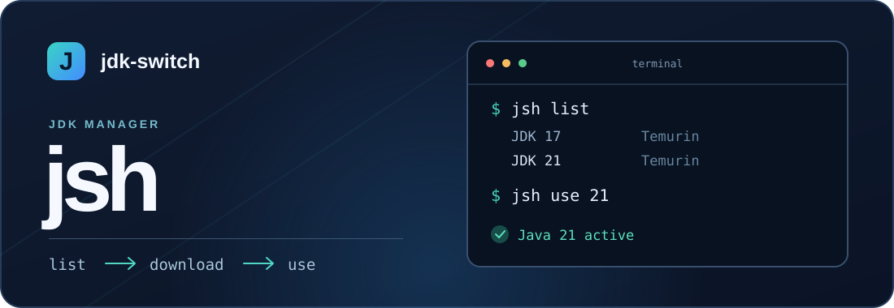

<p align="center">
  
</p>

<p align="center">
  <strong>Find a JDK. Choose a distribution. Switch Java from your terminal.</strong>
</p>

<p align="center">
  <a href="https://github.com/nanocm/jdk-switch/releases/latest">Download</a> ·
  <a href="README.zh-CN.md">简体中文</a> ·
  <a href="RELEASE_NOTES.md">Release notes</a>
</p>

## Install

The installer downloads the matching release, checks its SHA-256, and asks before adding the install directory to your user `PATH` when needed.

**Windows x64 · PowerShell**

```powershell
Invoke-WebRequest https://github.com/nanocm/jdk-switch/releases/latest/download/install.ps1 -OutFile install.ps1 -UseBasicParsing
powershell -NoProfile -ExecutionPolicy Bypass -File install.ps1
```

**Linux x64 · macOS x64 / ARM64**

```bash
curl -fsSL https://github.com/nanocm/jdk-switch/releases/latest/download/install.sh -o install.sh
bash install.sh
```

Windows defaults to `%LOCALAPPDATA%\Programs\jsh`; Unix defaults to `~/.local/bin`. Choose a writable directory with `-InstallDir 'D:\Tools\jsh'` or `--dir "$HOME/tools"`. Use `-PathAction Add` / `--add-to-path` for unattended setup, or `-PathAction Skip` / `--skip-path` to manage `PATH` yourself. Open a new terminal after the installer changes `PATH`. [Manual downloads](https://github.com/nanocm/jdk-switch/releases/latest) are also available.

## Quick start

```console
jsh list          # Find installed JDKs
jsh download 21   # Install Eclipse Temurin 21 (default)
jsh use 21        # Select it
jsh current       # Check the active Java
```

After the **first** `jsh use`, reload your shell once so it picks up `jsh-current/bin`:

| Windows | macOS / Linux |
| :--- | :--- |
| Reopen the terminal. | Run `source ~/.zshrc` or `source ~/.bashrc`. |

Later switches take effect in the same open terminal. If another Java comes first on `PATH`, `jsh current` reports the mismatch.

## Choose a distribution

```console
jsh search 21 --vendor zulu
jsh download 21 --vendor corretto
jsh download 21 --vendor zulu
jsh download 21 --vendor openjdk
```

| `--vendor` | Distribution | Package source |
| :--- | :--- | :--- |
| `temurin` (default) | Eclipse Temurin | Eclipse Adoptium |
| `corretto` | Amazon Corretto | Amazon Corretto |
| `zulu` | Azul Zulu | Azul metadata and CDN |
| `openjdk` | Official OpenJDK builds | `jdk.java.net` |

Official `openjdk` packages come from [jdk.java.net](https://jdk.java.net/) (JDK 12 and newer). Older releases are marked **archived** because those builds no longer receive security fixes.

When a primary package link fails, `jsh` tries the [Tsinghua Adoptium mirror](https://mirrors.tuna.tsinghua.edu.cn/help/Adoptium/) for Temurin or the [Huawei Cloud OpenJDK mirror](https://mirrors.huaweicloud.com/openjdk/) for OpenJDK. Package availability varies by release and platform. The downloaded file must match the source's size and SHA-256; a different build under the same filename is rejected. Huawei Cloud's older [`java/jdk` installer archive](https://repo.huaweicloud.com/java/jdk/) is not used.

## Put JDKs where you want

Create or edit `jsh_config.json` beside `jsh`:

```json
{
  "install_dir": "managed-jdks",
  "download_dir": "downloads",
  "scan_dirs": []
}
```

| Setting | Purpose |
| :--- | :--- |
| `install_dir` | Where `jsh download` installs extracted JDKs. Default: `jdks`. |
| `download_dir` | Where verified archive files are cached. Default: `downloads`. |
| `scan_dirs` | Extra existing directories checked by `jsh list`. Default: none. |

Relative paths start beside the executable. Absolute paths work too, for example `D:\Java\JDKs` on Windows or `/opt/jdks` on Unix. Changing `install_dir` does not move existing JDKs; `jsh list` still checks the original `jdks` directory.

An existing jsh `config.json` is imported automatically on first run. The old file is kept as a backup; `jsh_config.json` takes precedence thereafter.

## Commands

| Command | What it does |
| :--- | :--- |
| `jsh list` | List registered JDKs, managed directories, `scan_dirs`, and `JAVA_HOME`. |
| `jsh list --scan` | Also search common system locations. |
| `jsh list --prune` | Remove registrations whose paths are unavailable. |
| `jsh search [keyword] [--vendor NAME]` | Search versions from one distribution. |
| `jsh download <major> [--vendor NAME]` | Download, install, and register a JDK. |
| `jsh use <version-or-ID>` | Switch to an installed JDK. |
| `jsh current` | Show the active Java and detect a `PATH` mismatch. |

Multiple installations of the same version keep separate IDs. Use the ID shown by `jsh list` when a version is ambiguous.

<details>
<summary>Build from source</summary>

Requires Rust 1.88 or newer.

```console
cargo test --locked
cargo build --release --locked
```

</details>

<p align="center">
  Forked from <a href="https://github.com/YiTouch/j-switch">YiTouch/j-switch</a> · <a href="LICENSE">MIT license</a>
</p>
